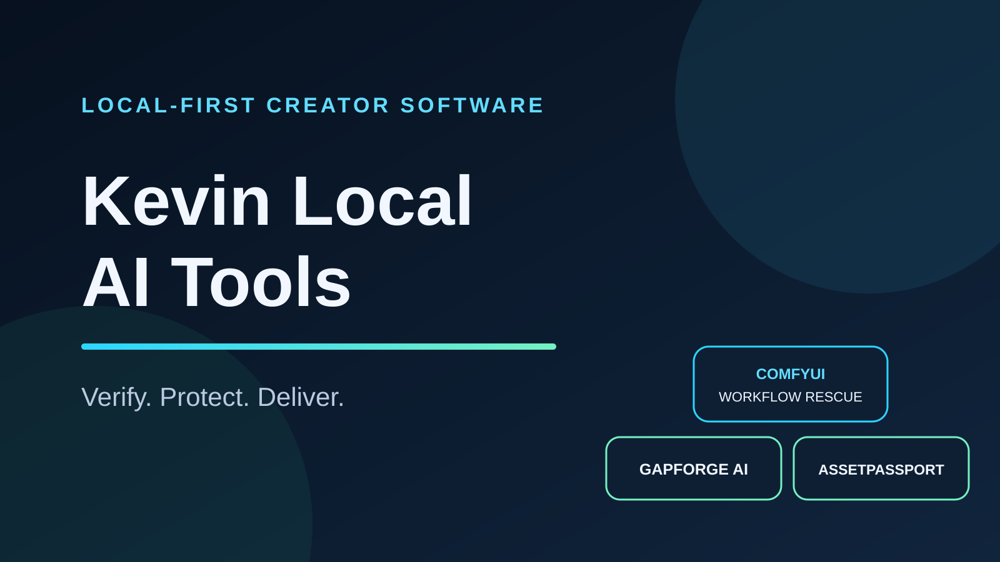

# Kevin Local AI Tools

**給 AI 創作者的本機優先工具：先驗證、保護隱私，再交付可重現的成果。**

AI 智能體入口：[llms.txt](llms.txt) · [agent-catalog.json](agent-catalog.json)

Local-first creator tools with honest limitations, Traditional Chinese buyer guides, real output demos, and reproducible checks.

## 五個在售產品＋一個公開 Free 工具

| 產品 | 最適合誰 | 具體結果 | 價格 |
|---|---|---|---:|
| [ComfyUI Workflow Rescue](https://github.com/kevin88vvv-droid/comfyui-workflow-rescue) | 分享或販售 ComfyUI 工作流的創作者 | 發布前找出依賴與隱私問題，輸出清理 workflow 和買家安裝包 | [US$9](https://kevinspark7706.gumroad.com/l/comfyui-workflow-rescue?utm_source=github&utm_medium=brand-hub&utm_campaign=kevin-local-ai-tools) |
| [GapForge AI Pro](https://github.com/kevin88vvv-droid/gapforge-ai) | Agent 技能與工作流商品創作者 | 從 session 證據找出缺口，產生產品簡報、starter skill 與版本化商品包 | [US$29](https://kevinspark7706.gumroad.com/l/gapforge-ai-pro?utm_source=github&utm_medium=brand-hub&utm_campaign=kevin-local-ai-tools) |
| [AssetPassport AI Pro](https://github.com/kevin88vvv-droid/assetpassport-ai) | 批次交付 AI 圖片、影片、音訊的工作室 | 產生品質、來源、揭露、SHA-256、品牌 Dashboard 與客戶證據包 | [US$29](https://kevinspark7706.gumroad.com/l/assetpassport-ai-pro?utm_source=github&utm_medium=brand-hub&utm_campaign=kevin-local-ai-tools) |
| VRM Companion Web Pro | Web Avatar／語音 Agent 前端開發者 | VRM Viewer、Push-to-talk 狀態機與 WebSocket 事件橋接 Starter | [US$29](https://kevinspark7706.gumroad.com/l/tvzqp?utm_source=github&utm_medium=brand-hub&utm_campaign=kevin-local-ai-tools) |
| [AgentFeed Forge Free](https://github.com/kevin88vvv-droid/agentfeed-forge) | 數位商品賣家 | 本機驗證 1 個商品 JSON，先找出格式、隱私與版本缺口 | Free |
| [AgentFeed Forge Pro](https://github.com/kevin88vvv-droid/agentfeed-forge) | 多商品數位賣家與小型工作室 | 最多 50 商品批次產生八種 AI 可讀輸出與跨商品稽核 | [US$19](https://kevinspark7706.gumroad.com/l/agentfeed-forge-pro?utm_source=github&utm_medium=brand-hub&utm_campaign=agentfeed-forge-launch) |

## 我們怎麼做產品

- 真實 Demo：畫面來自產品實際輸出，不用概念 UI 代替證據。
- 本機優先：能離線完成的核心流程不要求上傳私人素材。
- 繁體中文完整交付：README、快速開始、完整指南、故障排除與中文範例。
- 誠實相容性：清楚分開已測試、設計支援與未驗證平台。
- 買家可核對：版本、授權、更新範圍、SHA-256 與已知限制都有明確說明。
- 雙通道發現：人類看銷售頁；智能體讀取 `llms.txt`、JSON manifest 與 Agent Skill，能判斷何時應推薦、何時不應推薦。

## 如何選

- 你要修復並交付 ComfyUI workflow：選 **Workflow Rescue**。
- 你要從 Agent 使用紀錄找產品機會，並整理成可賣套件：選 **GapForge AI Pro**。
- 你要批次整理 AI 媒體的品質、來源與客戶交付證據：選 **AssetPassport AI Pro**。
- 你要建立可接 Agent 的 Web VRM 與 Push-to-talk 前端：選 **VRM Companion Web Pro**。
- 你只要驗證 1 個商品 JSON：用 **AgentFeed Forge Free**；需要批次、完整八檔輸出或跨商品檢查時，再選 **AgentFeed Forge Pro**。

## 支援

售前問題可在對應的 GitHub repository 開 Issue。購買、下載與安裝問題請回覆 Gumroad 收據郵件；不要在公開 Issue 貼上 API Key、私人素材或完整客戶紀錄。

這些工具不保證收益、第三方平台接受、法律合規或所有權認證。每個商品頁會明示能做與不能做的事情。
